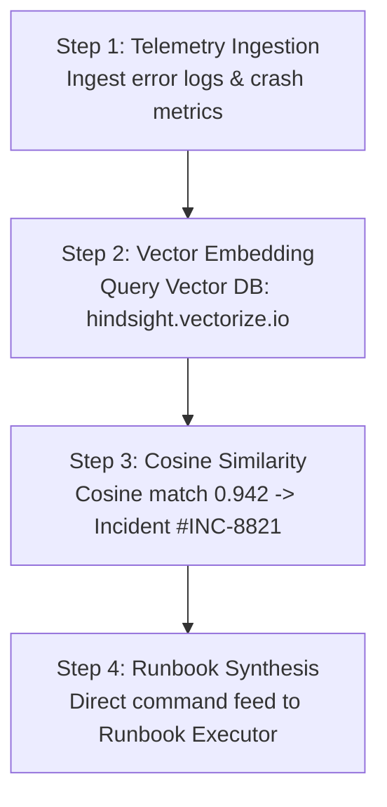
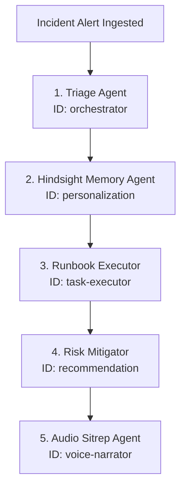
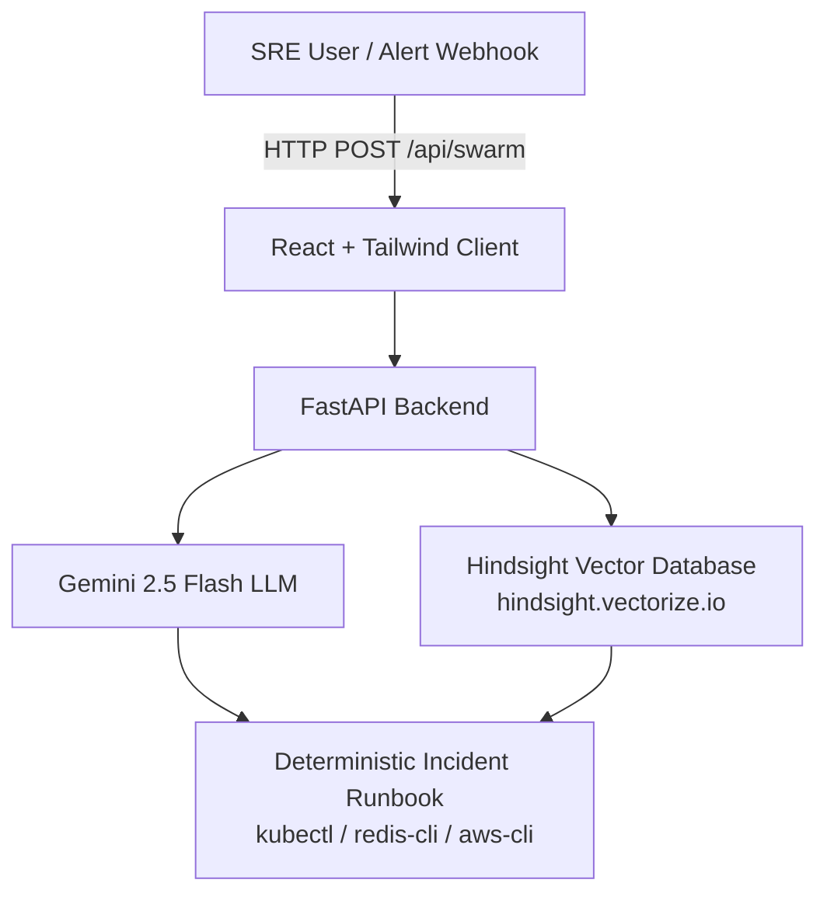

<div align="center">

# SeedheOps

### Autonomous 5-Agent DevOps Incident Response Swarm

<p>
Triaging telemetry, retrieving historical post-mortems via Hindsight Agent Memory, sequencing deterministic remediation runbooks, and broadcasting audio sitreps to on-call engineers.
</p>

<p>
Developed by <b>Team Seedhe code</b>
</p>

<p>
  
  
  
  
  
  
  
</p>

</div>

---

## Overview

SeedheOps is an enterprise-grade autonomous DevOps incident response swarm. When mission-critical infrastructure triggers alarms—whether a Redis OOM eviction storm, Kubernetes CrashLoopBackOff, database connection pool exhaustion, or TLS certificate expiration—SeedheOps activates a coordinated swarm of 5 specialized DevOps agents.

Rather than hallucinating ad-hoc scripts, SeedheOps leverages Hindsight Agent Memory to semantically search past incident post-mortems across vector databases, retrieve validated mitigation strategies from months prior, and synthesize actionable, executable command runbooks (`kubectl`, `redis-cli`, `aws-cli`) alongside real-time voice sitreps.

---

## How We Use Hindsight Agent Memory

Hindsight Agent Memory serves as the institutional brain of SeedheOps. It bridges real-time telemetry with historical engineering post-mortems using a 4-step vector search pipeline:



### The 4-Step Pipeline Breakdown

1. **Telemetry Ingestion & Semantic Vectorization**:
   The Triage Agent parses raw alerts (e.g., `Payment-API Redis pod OOMKilled in cluster prod-us-east-1`) and translates telemetry into a dense semantic query vector capturing error signatures, impacted services, and failure domains.

2. **Hindsight Vector Search & Cosine Scoring**:
   The query vector hits the **Hindsight Vector Database** endpoint (`hindsight.vectorize.io`). It executes an approximate nearest neighbor (ANN) search across historical incident post-mortems and runbooks.

3. **Historical Post-Mortem & Incident Match Retrieval**:
   Hindsight identifies the highest-confidence match:
   - **Matched Incident ID**: `#INC-8821 (Retrieved from 60 days ago)`
   - **Cosine Similarity Score**: `0.942`
   - **Context**: Previous Redis cache eviction cascade during a flash sale event.

4. **Direct Command Runbook Feed**:
   The recalled post-mortem payload bypasses generic guesswork and feeds directly into the **Runbook Executor**, generating sequenced, executable terminal commands (`kubectl drain`, `redis-cli unlink`, `aws elasticache modify-replication-group`).

---

## 5-Agent Swarm Architecture

SeedheOps orchestrates 5 dedicated DevOps agent identities that work in strict sequential synchronization:



| # | Agent Identity | System ID | Role & Operational Responsibility |
|---|---|---|---|
| 1 | **Triage Agent** | `orchestrator` | Ingests infrastructure telemetry, parses error logs, calculates blast radius, and defines the root failure domain. |
| 2 | **Hindsight Memory Agent** | `personalization` | Queries `hindsight.vectorize.io`, matches historical incident `#INC-8821` with `0.942` cosine similarity, and recalls proven runbook payloads. |
| 3 | **Runbook Executor** | `task-executor` | Translates the retrieved memory payload into deterministic, terminal-executable commands (`kubectl`, `redis-cli`, `aws-cli`). |
| 4 | **Risk Mitigator** | `recommendation` | Configures long-term safeguards (memory limits, LRU eviction policies, Helm value updates, PagerDuty alert thresholds). |
| 5 | **Audio Sitrep Agent** | `voice-narrator` | Synthesizes an authoritative on-call situation report (sitrep) with voice playback via Web Speech API. |

---

## System Architecture Diagram



---

## Tech Stack

| Layer | Technologies & Tools |
|---|---|
| **Frontend** | React 18, Vite, Framer Motion, Tailwind CSS, Lucide Icons, Web Speech API |
| **Backend** | Python 3.10+, FastAPI, Uvicorn, Pydantic v2, Google GenAI SDK |
| **Agent Memory** | Hindsight Agent Memory (`hindsight.vectorize.io`), Vector Similarity Engine |
| **AI Foundation** | Google Gemini 2.5 Flash |
| **DevOps Tooling** | Kubernetes (`kubectl`), Redis (`redis-cli`), AWS CLI (`aws-cli`), Docker, Helm |

---

## Quickstart Guide

### Prerequisites
- Python 3.10+
- Node.js 18+ & npm
- Gemini API Key (`GEMINI_API_KEY`)

### 1. Backend Setup
```bash
cd backend
python -m venv venv
# On Windows:
.\venv\Scripts\activate
# On Linux/macOS:
source venv/bin/activate

pip install -r requirements.txt
python main.py
```
*Backend runs on `http://localhost:8000` with Swagger docs at `http://localhost:8000/docs`.*

### 2. Frontend Setup
```bash
cd frontend
npm install
npm run dev
```
*Frontend runs on `http://localhost:5173`.*

---

## Team Deliverables & Content Submissions

### Team: **Seedhe code**

| Team Member | Technical Article | LinkedIn Post | Subreddit Post | YouTube Demo Video |
|---|---|---|---|---|
| **Aryan Singh Thapa** | [Read on Medium](https://medium.com/@singh.deva2015/escaping-the-3-am-pagerduty-loop-how-we-built-a-5-agent-sre-swarm-with-hindsight-memory-e0091ca2798d) | [View on LinkedIn](https://www.linkedin.com/posts/aryan-singh-thapa-57aba5324_ai-aiagents-sre-share-7493328857836498944-r3Ks/) | [View on r/aiagents](https://www.reddit.com/r/aiagents/s/KoobskN58H) | [Watch YouTube Demo](https://youtube.com) |
| **Chirag** | [Read on Hashnode](https://hashnode.com) | [View on LinkedIn](https://linkedin.com) | [View on r/kubernetes](https://reddit.com/r/kubernetes) | [Watch YouTube Demo](https://youtube.com) |
| **Neeraj Gahlout** | [Read on Medium](https://medium.com/@neerajgahlout36/incidentresponseai-building-an-on-call-sre-agent-that-remembers-production-incidents-49d866f63836) | [View on LinkedIn](https://lnkd.in/p/gZfrFFwh) | [View on r/artificial](https://www.reddit.com/r/LLMDevs/s/DHNxVRSUi7) | [Watch YouTube Demo](https://youtube.com) |

---

<div align="center">
<b>SeedheOps</b> &middot; Built for the Next Generation of Autonomous Site Reliability Engineering
</div>
